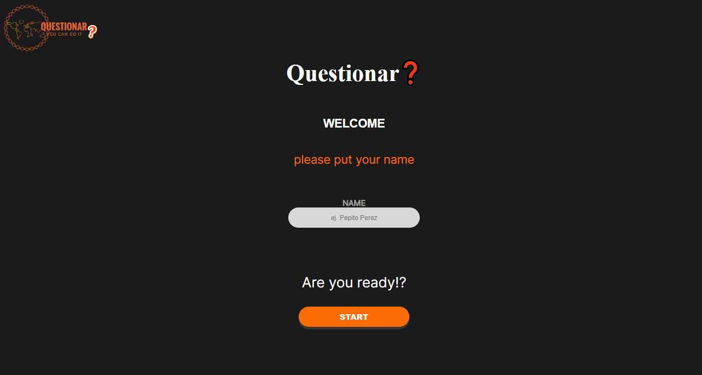
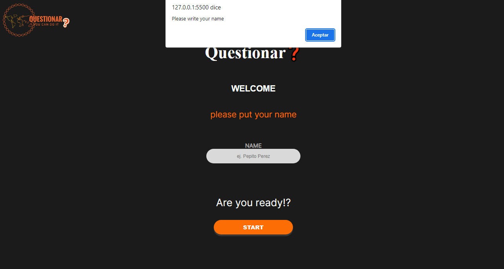
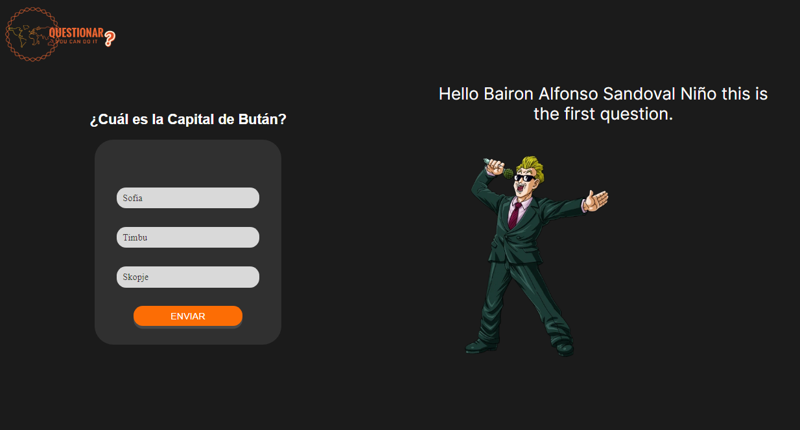
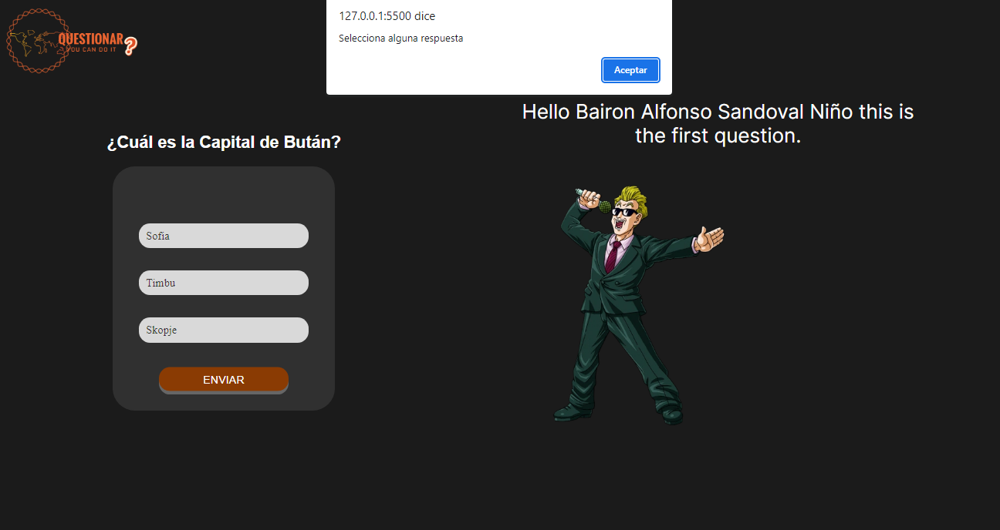

# Trivia
Desarrollado por Jose Ramirez y Bairon Sandoval
## Índice

* [1. Resumen del proyecto](#1-resumen-del-proyecto)
* [2. Como se desarrollo](#2-camo-se-desarrollo)
* [3. aprendizaje](#3-aprendizaje)
* [4. Consideraciones generales](#4-consideraciones-generales)
* [5. Recomendaciones](#5-recomendaciones)
* [6. Alcance del proyecto](#6-alcance-del-proyecto)
* [7. Ambiente de trabajo y lecturas complementarias](#7-ambiente-de-trabajo-y-lecturas-complementarias)
* [8. Consideraciones técnicas](#8-consideraciones-técnicas)

***

## 1. Resumen del proyecto

Esta es un juego de trivia donde se evalua el conocimiento acerca de paises y capitales. Dandole al usuario opciones de respuestas.

## 2. Como se desarrollo

iniciamos diseñando el prototipo final atravez de una herramienta de diseño, en la cual nos basamos para construir la estructura visual y funcional del juego

**Wireframe**

Pantalla 1


Pantalla 2, 3, 4


Pantalla Final


**Resultado Final**

Pantalla 1



Pantalla alerta escribe tu nombre, se muestra en caso de que no se coloque ningun nombre



Pantalla 2



Pantalla alerta selecciona respuesta, se muestra en caso que no se coloque ninguna respuesta



Pantalla final


## 3. Aprendizaje

### HTML

- [ ] **Uso de HTML semántico**

  <details><summary>Links</summary><p>

  * [HTML semántico](https://curriculum.laboratoria.la/es/topics/html/02-html5/02-semantic-html)
  * [Semantics - MDN Web Docs Glossary](https://developer.mozilla.org/en-US/docs/Glossary/Semantics#Semantics_in_HTML)
</p></details>

### CSS

- [ ] **Uso de selectores de CSS**

  <details><summary>Links</summary><p>

  * [Intro a CSS](https://curriculum.laboratoria.la/es/topics/css/01-css/01-intro-css)
  * [CSS Selectors - MDN](https://developer.mozilla.org/es/docs/Web/CSS/CSS_Selectors)
</p></details>

### Web APIs

- [ ] **Uso de selectores del DOM**

  <details><summary>Links</summary><p>

  * [Manipulación del DOM](https://curriculum.laboratoria.la/es/topics/browser/02-dom/03-1-dom-methods-selection)
  * [Introducción al DOM - MDN](https://developer.mozilla.org/es/docs/Web/API/Document_Object_Model/Introduction)
  * [Localizando elementos DOM usando selectores - MDN](https://developer.mozilla.org/es/docs/Web/API/Document_object_model/Locating_DOM_elements_using_selectors)
</p></details>

- [ ] **Manejo de eventos del DOM (listeners, propagación, delegación)**

  <details><summary>Links</summary><p>

  * [Introducción a eventos - MDN](https://developer.mozilla.org/es/docs/Learn/JavaScript/Building_blocks/Events)
  * [EventTarget.addEventListener() - MDN](https://developer.mozilla.org/es/docs/Web/API/EventTarget/addEventListener)
  * [EventTarget.removeEventListener() - MDN](https://developer.mozilla.org/es/docs/Web/API/EventTarget/removeEventListener)
  * [El objeto Event](https://developer.mozilla.org/es/docs/Web/API/Event)
</p></details>

- [ ] **Manipulación dinámica del DOM**

  <details><summary>Links</summary><p>

  * [Introducción al DOM](https://developer.mozilla.org/es/docs/Web/API/Document_Object_Model/Introduction)
  * [Node.appendChild() - MDN](https://developer.mozilla.org/es/docs/Web/API/Node/appendChild)
  * [Document.createElement() - MDN](https://developer.mozilla.org/es/docs/Web/API/Document/createElement)
  * [Document.createTextNode()](https://developer.mozilla.org/es/docs/Web/API/Document/createTextNode)
  * [Element.innerHTML - MDN](https://developer.mozilla.org/es/docs/Web/API/Element/innerHTML)
  * [Node.textContent - MDN](https://developer.mozilla.org/es/docs/Web/API/Node/textContent)
</p></details>

### JavaScript

- [ ] **Tipos de datos primitivos**

  <details><summary>Links</summary><p>

  * [Valores primitivos - MDN](https://developer.mozilla.org/es/docs/Web/JavaScript/Data_structures#valores_primitivos)
</p></details>

- [ ] **Strings (cadenas de caracteres)**

  <details><summary>Links</summary><p>

  * [Strings](https://curriculum.laboratoria.la/es/topics/javascript/06-strings)
  * [String — Cadena de caracteres - MDN](https://developer.mozilla.org/es/docs/Web/JavaScript/Reference/Global_Objects/String)
</p></details>

- [ ] **Variables (declaración, asignación, ámbito)**

  <details><summary>Links</summary><p>

  * [Valores, tipos de datos y operadores](https://curriculum.laboratoria.la/es/topics/javascript/01-basics/01-values-variables-and-types)
  * [Variables](https://curriculum.laboratoria.la/es/topics/javascript/01-basics/02-variables)
</p></details>

- [ ] **Uso de condicionales (if-else, switch, operador ternario, lógica booleana)**

  <details><summary>Links</summary><p>

  * [Estructuras condicionales y repetitivas](https://curriculum.laboratoria.la/es/topics/javascript/02-flow-control/01-conditionals-and-loops)
  * [Tomando decisiones en tu código — condicionales - MDN](https://developer.mozilla.org/es/docs/Learn/JavaScript/Building_blocks/conditionals)
</p></details>

- [ ] **Funciones (params, args, return)**

  <details><summary>Links</summary><p>

  * [Funciones (control de flujo)](https://curriculum.laboratoria.la/es/topics/javascript/02-flow-control/03-functions)
  * [Funciones clásicas](https://curriculum.laboratoria.la/es/topics/javascript/03-functions/01-classic)
  * [Arrow Functions](https://curriculum.laboratoria.la/es/topics/javascript/03-functions/02-arrow)
  * [Funciones — bloques de código reutilizables - MDN](https://developer.mozilla.org/es/docs/Learn/JavaScript/Building_blocks/Functions)
</p></details>

- [ ] **Uso de identificadores descriptivos (Nomenclatura y Semántica)**

### UX (User eXperience)

- [ ] **Diseñar la aplicación pensando en y entendiendo al usuario**

- [ ] **Crear prototipos para obtener feedback e iterar**

# Trivia

## Índice

* [1. Preámbulo](#1-preámbulo)
* [2. Resumen del proyecto](#2-resumen-del-proyecto)
* [3. Objetivos de aprendizaje](#3-objetivos-de-aprendizaje)
* [4. Consideraciones generales](#4-consideraciones-generales)
* [5. Recomendaciones](#5-recomendaciones)
* [6. Alcance del proyecto](#6-alcance-del-proyecto)
* [7. Ambiente de trabajo y lecturas complementarias](#7-ambiente-de-trabajo-y-lecturas-complementarias)
* [8. Consideraciones técnicas](#8-consideraciones-técnicas)

***

## 1. Preámbulo

Una _trivia_ es un tipo de juego, generalmente en el marco de un concurso, en el
que se plantea una serie de preguntas cuyas respuestas deben ser elegidas entre
diferentes opciones predeterminadas.

En la actualidad existen muchas posibilidades de participar de una _trivia
online_. Con una rápida búsqueda en Internet, te podrás dar cuenta de que existen
_trivias_ de diversas temáticas (ciencia, series, televisión, etc.).


## 2. Resumen del proyecto

**¿Qué tengo que hacer exactamente?** Como es obvio, construirás la aplicación Web de una _trivia_. No temas, vas a aprender mucho estos días.

El objetivo principal de este proyecto es que tengas una primera experiencia desarrollando aplicaciones Web que interactúen con las usuarias a través del navegador, utilizando HTML, CSS y JavaScript.

La temática es libre, decídela rápidamente y luego piensa en cómo debe ser la experiencia para tus usuarias. Piensa en las pantallas, el flujo, los mensajes, colores, etc.

## 3. Objetivos de aprendizaje


Reflexiona y luego marca los objetivos que has llegado a entender y aplicar en tu proyecto. Piensa en eso al decidir tu estrategia de trabajo.

### HTML

- [ ] **Uso de HTML semántico**

  <details><summary>Links</summary><p>

  * [HTML semántico](https://curriculum.laboratoria.la/es/topics/html/02-html5/02-semantic-html)
  * [Semantics - MDN Web Docs Glossary](https://developer.mozilla.org/en-US/docs/Glossary/Semantics#Semantics_in_HTML)
</p></details>

### CSS

- [ ] **Uso de selectores de CSS**

  <details><summary>Links</summary><p>

  * [Intro a CSS](https://curriculum.laboratoria.la/es/topics/css/01-css/01-intro-css)
  * [CSS Selectors - MDN](https://developer.mozilla.org/es/docs/Web/CSS/CSS_Selectors)
</p></details>

### Web APIs

- [ ] **Uso de selectores del DOM**

  <details><summary>Links</summary><p>

  * [Manipulación del DOM](https://curriculum.laboratoria.la/es/topics/browser/02-dom/03-1-dom-methods-selection)
  * [Introducción al DOM - MDN](https://developer.mozilla.org/es/docs/Web/API/Document_Object_Model/Introduction)
  * [Localizando elementos DOM usando selectores - MDN](https://developer.mozilla.org/es/docs/Web/API/Document_object_model/Locating_DOM_elements_using_selectors)
</p></details>

- [ ] **Manejo de eventos del DOM (listeners, propagación, delegación)**

  <details><summary>Links</summary><p>

  * [Introducción a eventos - MDN](https://developer.mozilla.org/es/docs/Learn/JavaScript/Building_blocks/Events)
  * [EventTarget.addEventListener() - MDN](https://developer.mozilla.org/es/docs/Web/API/EventTarget/addEventListener)
  * [EventTarget.removeEventListener() - MDN](https://developer.mozilla.org/es/docs/Web/API/EventTarget/removeEventListener)
  * [El objeto Event](https://developer.mozilla.org/es/docs/Web/API/Event)
</p></details>

- [ ] **Manipulación dinámica del DOM**

  <details><summary>Links</summary><p>

  * [Introducción al DOM](https://developer.mozilla.org/es/docs/Web/API/Document_Object_Model/Introduction)
  * [Node.appendChild() - MDN](https://developer.mozilla.org/es/docs/Web/API/Node/appendChild)
  * [Document.createElement() - MDN](https://developer.mozilla.org/es/docs/Web/API/Document/createElement)
  * [Document.createTextNode()](https://developer.mozilla.org/es/docs/Web/API/Document/createTextNode)
  * [Element.innerHTML - MDN](https://developer.mozilla.org/es/docs/Web/API/Element/innerHTML)
  * [Node.textContent - MDN](https://developer.mozilla.org/es/docs/Web/API/Node/textContent)
</p></details>

### JavaScript

- [ ] **Tipos de datos primitivos**

  <details><summary>Links</summary><p>

  * [Valores primitivos - MDN](https://developer.mozilla.org/es/docs/Web/JavaScript/Data_structures#valores_primitivos)
</p></details>

- [ ] **Strings (cadenas de caracteres)**

  <details><summary>Links</summary><p>

  * [Strings](https://curriculum.laboratoria.la/es/topics/javascript/06-strings)
  * [String — Cadena de caracteres - MDN](https://developer.mozilla.org/es/docs/Web/JavaScript/Reference/Global_Objects/String)
</p></details>

- [ ] **Variables (declaración, asignación, ámbito)**

  <details><summary>Links</summary><p>

  * [Valores, tipos de datos y operadores](https://curriculum.laboratoria.la/es/topics/javascript/01-basics/01-values-variables-and-types)
  * [Variables](https://curriculum.laboratoria.la/es/topics/javascript/01-basics/02-variables)
</p></details>

- [ ] **Uso de condicionales (if-else, switch, operador ternario, lógica booleana)**

  <details><summary>Links</summary><p>

  * [Estructuras condicionales y repetitivas](https://curriculum.laboratoria.la/es/topics/javascript/02-flow-control/01-conditionals-and-loops)
  * [Tomando decisiones en tu código — condicionales - MDN](https://developer.mozilla.org/es/docs/Learn/JavaScript/Building_blocks/conditionals)
</p></details>

- [ ] **Funciones (params, args, return)**

  <details><summary>Links</summary><p>

  * [Funciones (control de flujo)](https://curriculum.laboratoria.la/es/topics/javascript/02-flow-control/03-functions)
  * [Funciones clásicas](https://curriculum.laboratoria.la/es/topics/javascript/03-functions/01-classic)
  * [Arrow Functions](https://curriculum.laboratoria.la/es/topics/javascript/03-functions/02-arrow)
  * [Funciones — bloques de código reutilizables - MDN](https://developer.mozilla.org/es/docs/Learn/JavaScript/Building_blocks/Functions)
</p></details>

- [ ] **Uso de identificadores descriptivos (Nomenclatura y Semántica)**

### UX (User eXperience)

- [ ] **Diseñar la aplicación pensando en y entendiendo al usuario**

- [ ] **Crear prototipos para obtener feedback e iterar**

## 4. Consideraciones generales

* Completar el proyecto **no es un requisito para ser admitida al _bootcamp_**.
* Este proyecto se debe trabajar en duplas.
* Preocúpate de que ambas puedan hacer y aprender de todo. Esto no se trata 
de "repartir" el trabajo para hacer "más". El objetivo es aprender 
colaborativamente, no "terminar y entregar".
* Queremos verte aprender lo que aún no sabes. Sé transparente para que podamos 
entender tu proceso de aprendizaje. Nos interesa el proceso y no solamente el
resultado final.

## 5. Recomendaciones
### 5.1. Prototipo.
Algo que siempre ayuda a "poner en concreto” lo que tienes en mente, es hacer un
simple prototipo en papel y lápiz **de todo el proyecto**. Dibujar es un proceso
rápido que permite entender cómo, cuándo y dónde suceden las cosas;
dónde exactamente debe decir tal o cual cosa, qué pasa si la usuaria hace A o B,
dónde debe hacer _click_, qué información exactamente quieres mostrarle, etc.
**Dedica un máximo de dos horas a esto antes de ponerte a codear**.

### 5.2. No postergues lo que no sabes hacer, comienza por ahí
No gastes horas discutiendo la temática de la _trivia_ o haciendo logotipos 
teniendo la sensación de que estás “avanzando”. Es natural que tengas el impulso 
de hacerlo, es tu cerebro pidiendo su dosis de **satisfacción inmediata**. No te 
dejes engañar por la “ilusión” del avance, **tu objetivo es aprender**. Enfréntate a lo que no sabes lo más pronto posible, es el único camino 
para lograrlo.

### 5.3. Aprender por encima de completar el proyecto
Evita la tentación de copiar y pegar código que “funcione” para ir completando
el proyecto sin entender cómo ni por qué funciona. Prefiere siempre hacer poco
pero que sea algo que entiendes y puedes explicar, antes que mucho que funciona a
medias y/o que no sabes bien cómo ni por qué funciona.

### 5.4. Achicar el gran problema en problemas más pequeños
Un "superpoder" que esperamos puedas desarrollar durante el _bootcamp_ es el de
definir "micro-proyectos" que te acerquen paso a paso, pero de manera transversal,
a la solución del "gran proyecto".  Podríamos decir que es algo así como comenzar
armando un rompecabezas/_puzzle_ por las esquinas o bordes sin saber necesariamente
cómo encajarán al final. Déjate llevar y explora libremente, no tienes que saberlo
todo antes de comenzar.

Más adelante te daremos algunas sugerencias como ejemplo.

## 6. Alcance del proyecto
Sabemos que cada una de ustedes sabe un poco más o un poco menos de Desarrollo Web;
no olvidamos que cada una tiene experiencias de vida y motivaciones distintas, 
personalidad diferente, aprende a su propio ritmo, etc. Pretender que todo lo 
anterior no existe y pedir a todas que logren aprender y completar lo mismo sería 
absurdo. Te proponemos trabajar en hitos o etapas incrementales según tus 
posibilidades **No esperamos que todas completen los 3 hitos**.

No trabajes como si fuera una fábrica haciendo tooooooooooooooooooooooooodo el 
HTML y CSS de todas las pantallas que imaginaste para luego comenzar con el 
toooooooooooooooooooooodo el JavaScript y la funcionalidad. El riesgo de trabajar 
así es que consigas muchas partes sin ninguna funcionalidad o a medias y que 
aprendas poco; tampoco hagas lo inverso, un montón de funcionalidad en la consola 
pero que no tiene una interfaz para ser utilizada por una usuaria no-_developer_.

La siguiente metáfora te puede ayudar a comprender mejor la idea.


Esas etapas, desde la patineta hasta el auto, es a lo que llamaremos "hitos".
Eres libre de seguir esta recomendación o trabajar como tú prefieras. Quizás te
sea útil si recién estás comenzando a aprender de Desarrollo Web, tú decides. 

_Spoiler alert_: anda practicando tomar tus propias decisiones de aprendizaje, a
sí serán los 6 meses de _bootcamp_.

-----------
### Hito 1
La versión más simple de una _trivia_.
- 1 sola pantalla o vista.
- 2 preguntas con, al menos, 3 alternativas de respuesta cada una.
- 1 botón para responder y ver cuál es la alternativa correcta.
- No te dice si acertaste o no, sólo te dice cuál alternativa era la correcta.

<details>
<summary>Sugerencia de micro-proyecto A</summary>

##### Solamente el "esqueleto" estático
- Dos preguntas con sus respectivas alternativas de respuesta en forma de
_radio buttons_ (🔘)
- El botón para “Responder y ver resultados”.

##### Aprenderás:
Cómo construir una página básica HTML con elementos de formulario.
</details>

<details>
<summary>Sugerencia de micro-proyecto B</summary>

##### Vamos a darle algo de interacción
Cuando la usuaria dé _click_ en alguno de los _radio button_, muéstrale un
mensaje de alerta (_alert_) en el navegador que contenga el valor (texto) del
_radio button_ cliqueado.

**Pista**: Para mostrar un mensaje de alerta básico hay una función de JavaScript
llamada “_alert_”. Esta función puede “escuchar” eventos del navegador como
_click_ y hacer algo cuando suceda usando _onclick_ o _addEventListener_.

##### Aprenderás:
- A detectar eventos en el navegador (los _clicks_ de la usuaria) y hacer algo
cuando sucedan.
- Identificar los elementos HTML que hay en el navegador y obtener sus valores
y/o estados.

</details>
<details>
<summary>Sugerencia de micro-proyecto C</summary>

##### Prueba darle algo de interacción más cercana a la que pide el proyecto
En lugar de mostrar el valor de cada _radio button_ cuando se le hace _click_,
que esta vez solamente se marque el _radio button_ seleccionado y que el mensaje 
_alert_ con  los valores de los _radio button_ seleccionados se muestre cuando 
al hacer _click_ en el botón “Responder y ver resultados”.

##### Aprenderás:
- A detectar eventos en el navegador (los _clicks_ de la usuaria) .
- Identificar los elementos HTML que hay en el navegador y obtener sus valores/estados.

</details>

-----------
### Hito 2
Agrega una pantalla simple de bienvenida con los siguientes elementos y características:
- Una caja de texto (_input text_) en la que escribe su nombre quien juega.
- Un botón de "jugar" o "comenzar" para ir a las preguntas.
- Esta vez deberán haber al menos 3 preguntas con sus respectivas alternativas
de respuesta.
- Antes de las peguntas debe decir "Hola [el nombre que se escribió en la
pantalla de bienvenida]"
- El botón para responder muestra la alternativa correcta para cada pregunta y,
además, muestra si cada una de las respuestas fue correcta o incorrecta.
- Un botón para volver a jugar que vuelve a la pantalla inicial en la que se
pide el nombre.

<details>
<summary>Sugerencia de micro-proyecto A</summary>

##### Evaluando las respuestas de tu usuaria
Para determinar si las respuestas seleccionadas son correctas o incorrectas, 
necesitas predefinir cuál alternativa es la correcta para cada pregunta y evaluar 
(comparar) si la respuesta de tu usuaria coincide o no.

**Pistas:** Lee sobre condicionales y control de flujo (IF, ELSE).

##### Aprenderás:
- A identificar los elementos HTML que hay en el navegador y obtener sus
valores/estados.
- Comparar los valores/estados de los elementos y hacer algo según el
resultado que obtengas de la comparación/evaluación.

</details>

-----------

### Hito 3
- Permítele a la usuaria elegir entre 2 tipos de preguntas después de escribir
su nombre y antes de ir a responder.
Por ejemplo, unas sobre comida y otras sobre cervezas.
- Agrega un puntaje a respuestas correctas e incorrectas y muestra un puntaje
total al final.

-----------

Si hiciste todo lo anterior y tienes un poco más de tiempo, decide qué más
quisieras hacer para mejorar tu proyecto. Podrías, por ejemplo, agregar una
cuenta regresiva con un tiempo límite para responder a las preguntas. Puedes
subir tu código a un repositorio de GitHub y publicar tu aplicación _Web en
GitHub Pages y compartir la URL con quien quieras.

Independientemente de hasta qué hito alcances a hacer, asegúrate de documentar
**brevemente** tu trabajo en un documento de Google o el archivo `README.md`
de tu repositorio (si es que estás trabajando con uno). Cuéntanos un poco cómo 
fue tu proceso de diseño de la experiencia de uso y cómo crees que resuelve el la 
necesidad (o "problema") que tiene tu usuaria. Incluye algunas imágenes de tus prototipos en papel y lápiz que nos ayuden a entender el proceso, no el resultado. 
¿Fuiste cambiando cosas en el camino?, ¿cuáles?, ¿por qué?.

## 7. Ambiente de trabajo y lecturas complementarias

### Prepara tu ambiente de trabajo
#### Si estás dando tus primeros pasos en el Desarrolo Web:
Quizás prefieras trabajar con alguna herramienta de edición de código en línea
como [Codepen](https://codepen.io/pen/) o [Replit](https://replit.com/).

#### Si ya tienes cierta experiencia y vas a trabajar con un repositorio de código:

1. Antes que nada, asegúrate de tener un :pencil: editor de texto en
   condiciones, algo como [Atom](https://atom.io/) o
   [Visual Studio Code](https://code.visualstudio.com/).
2. Para ejecutar los comandos a continuación necesitarás una :shell:
   [UNIX Shell](../../topics/shell),
   que es un programita que interpreta líneas de comando (command-line
   interpreter) así como tener [git](../../topics/scm/01-git)
   instalado. Si usas un sistema operativo "UNIX-like", como GNU/Linux o MacOS,
   ya tienes una _shell_ (terminal) instalada por defecto (y probablemente `git`
   también). Si usas Windows puedes usar [Git bash](https://git-scm.com/download/win),
   aunque recomendaría que consideres probar :penguin: GNU/Linux.
3. Haz tu propio :fork_and_knife: [fork](https://help.github.com/articles/fork-a-repo/)
   del repo de tu cohort, tus _coaches_ te compartirán un _link_ a un repo y te
   darán acceso de lectura en ese repo.
4. :arrow_down: [Clona](https://help.github.com/articles/cloning-a-repository/)
   tu *fork* a tu computadora (copia local).

### Recursos y temas relacionados

#### Diseño de experiencia de usuario (User Experience Design)

* [Blog sobre diseño de experiencia de usuario](https://medium.com/laboratoria/qu%C3%A9-es-ser-una-ux-designer-f81fbc45a44c)

#### Desarrollo Front-end

* [Tipos de valores](https://lms.laboratoria.la/cohorts/bog-2021-11-prebootcamp-js-bog005/topics/javascript/01-basics/01-values-variables-and-types)
* [Declaración de variables](https://lms.laboratoria.la/cohorts/bog-2021-11-prebootcamp-js-bog005/topics/javascript/01-basics/02-variables)
* [Control de flujo](https://lms.laboratoria.la/cohorts/bog-2021-11-prebootcamp-js-bog005/topics/javascript/02-flow-control/00-opening)

#### Herramientas

* [Git](https://git-scm.com/)
* [GitHub](https://github.com/)
* [GitHub Pages](https://pages.github.com/)

#### Organización del Trabajo

* [Metodologías Ágiles](https://www.youtube.com/watch?v=v3fLx7VHxGM)
* [Scrum en menos de 2 minutos](https://www.youtube.com/watch?v=TRcReyRYIMg)
* [Scrum en Detalle](https://youtu.be/nOlwF3HRrAY). No
  esperamos que hagas todo eso desde este proyecto.

####  Entrega

* Todo tu proyecto debe estar como entregable en un link funcional, puede ser el link de tu repositorio de github o el link de tu proyecto en linea ya sea  [Replit](https://repl.it), [Codepen](https://codepen.io/pen/) o [CodeSandbox](https://codesandbox.io/)

## 8. Consideraciones técnicas

La lógica del proyecto debe estar implementada completamente en JS, HTML y CSS
En este proyecto no uses librerías o _frameworks_, solo [vanilla JavaScript](https://medium.com/laboratoria-how-to/vanillajs-vs-jquery-31e623bbd46e).

Este _boilerplate_ (plantilla de proyecto en el repositorio de GitHub) contiene
tres archivo, eres libre agregar o quitar archivos/carpetas. **Si usas un editor
de código en línea como Codepen o Replit omite este punto.**

### `src/index.html`

Acá va la página que se mostrará al usuario, también nos sirve para indicar
qué script se usará y unir todo lo que hemos hecho.

Encontrarás 1 etiqueta inicial, la cual si deseas puedes borrar y empezar de
cero:

```html
 <div id="root"></div>
```

### `src/style.css`

Este archivo debe contener las reglas de estilo. Queremos que escribas tus
propias reglas, por eso te pedimos que no uses _frameworks_ de CSS
(Bootstrap, Materialize, etc).

### `src/main.js`

Acá escribirás todo el código que tenga que ver con la interacción del DOM
(seleccionar, actualizar y manipular elementos del DOM y eventos), entre otras
funciones que sean necesarias para actualizar el resultado en la pantalla (UI).

¡A codear se ha dicho! 
