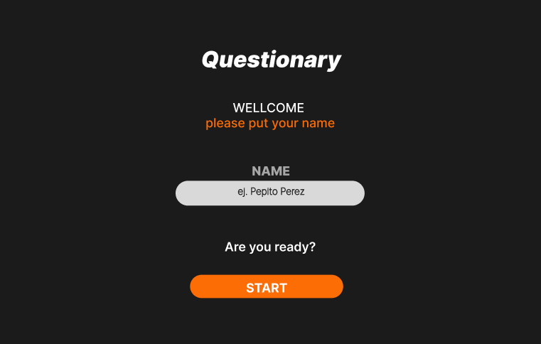
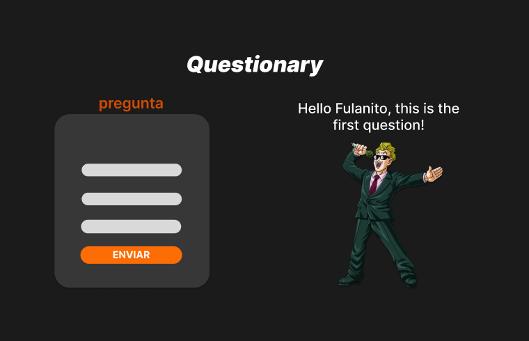
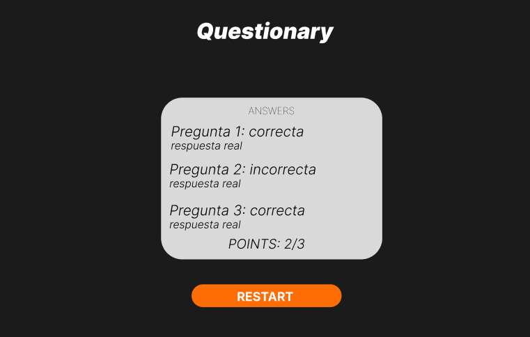
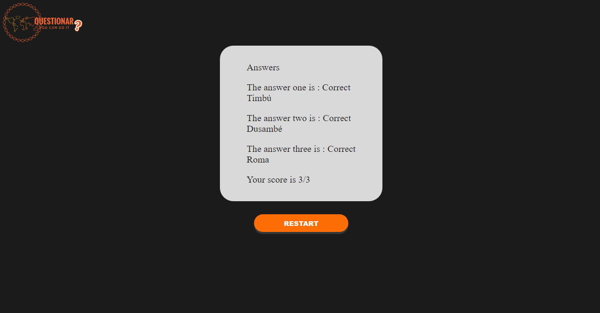

# Trivia
Desarrollado por Jose Ramirez y Bairon Sandoval
## Índice

* [1. Resumen del proyecto](#1-resumen-del-proyecto)
* [2. Como se desarrollo](#2-camo-se-desarrollo)
* [3. aprendizaje](#3-aprendizaje)
* [4. Consideraciones generales](#4-consideraciones-generales)
* [5. Recomendaciones](#5-recomendaciones)
* [6. Alcance del proyecto](#6-alcance-del-proyecto)
* [7. Ambiente de trabajo y lecturas complementarias](#7-ambiente-de-trabajo-y-lecturas-complementarias)
* [8. Consideraciones técnicas](#8-consideraciones-técnicas)

***

## 1. Resumen del proyecto

Esta es un juego de trivia donde se evalua el conocimiento acerca de paises y capitales. Dandole al usuario opciones de respuestas.

## 2. Como se desarrollo

iniciamos diseñando el prototipo final atravez de una herramienta de diseño, en la cual nos basamos para construir la estructura visual y funcional del juego

**Wireframe**

Pantalla 1

Pantalla 2, 3, 4

Pantalla Final

**Resultado Final**

Pantalla 1

Pantalla alerta escribe tu nombre, se muestra en caso de que no se coloque ningun nombre

Pantalla 2

Pantalla alerta selecciona respuesta, se muestra en caso que no se coloque ninguna respuesta

Pantalla final

## 3. Aprendizaje

### HTML

- [ ] **Uso de HTML semántico**

  

Links

  * [HTML semántico](https://curriculum.laboratoria.la/es/topics/html/02-html5/02-semantic-html)
  * [Semantics - MDN Web Docs Glossary](https://developer.mozilla.org/en-US/docs/Glossary/Semantics#Semantics_in_HTML)

### CSS

- [ ] **Uso de selectores de CSS**

  

Links

  * [Intro a CSS](https://curriculum.laboratoria.la/es/topics/css/01-css/01-intro-css)
  * [CSS Selectors - MDN](https://developer.mozilla.org/es/docs/Web/CSS/CSS_Selectors)

### Web APIs

- [ ] **Uso de selectores del DOM**

  

Links

  * [Manipulación del DOM](https://curriculum.laboratoria.la/es/topics/browser/02-dom/03-1-dom-methods-selection)
  * [Introducción al DOM - MDN](https://developer.mozilla.org/es/docs/Web/API/Document_Object_Model/Introduction)
  * [Localizando elementos DOM usando selectores - MDN](https://developer.mozilla.org/es/docs/Web/API/Document_object_model/Locating_DOM_elements_using_selectors)

- [ ] **Manejo de eventos del DOM (listeners, propagación, delegación)**

  

Links

  * [Introducción a eventos - MDN](https://developer.mozilla.org/es/docs/Learn/JavaScript/Building_blocks/Events)
  * [EventTarget.addEventListener() - MDN](https://developer.mozilla.org/es/docs/Web/API/EventTarget/addEventListener)
  * [EventTarget.removeEventListener() - MDN](https://developer.mozilla.org/es/docs/Web/API/EventTarget/removeEventListener)
  * [El objeto Event](https://developer.mozilla.org/es/docs/Web/API/Event)

- [ ] **Manipulación dinámica del DOM**

  

Links

  * [Introducción al DOM](https://developer.mozilla.org/es/docs/Web/API/Document_Object_Model/Introduction)
  * [Node.appendChild() - MDN](https://developer.mozilla.org/es/docs/Web/API/Node/appendChild)
  * [Document.createElement() - MDN](https://developer.mozilla.org/es/docs/Web/API/Document/createElement)
  * [Document.createTextNode()](https://developer.mozilla.org/es/docs/Web/API/Document/createTextNode)
  * [Element.innerHTML - MDN](https://developer.mozilla.org/es/docs/Web/API/Element/innerHTML)
  * [Node.textContent - MDN](https://developer.mozilla.org/es/docs/Web/API/Node/textContent)

### JavaScript

- [ ] **Tipos de datos primitivos**

  

Links

  * [Valores primitivos - MDN](https://developer.mozilla.org/es/docs/Web/JavaScript/Data_structures#valores_primitivos)

- [ ] **Strings (cadenas de caracteres)**

  

Links

  * [Strings](https://curriculum.laboratoria.la/es/topics/javascript/06-strings)
  * [String — Cadena de caracteres - MDN](https://developer.mozilla.org/es/docs/Web/JavaScript/Reference/Global_Objects/String)

- [ ] **Variables (declaración, asignación, ámbito)**

  

Links

  * [Valores, tipos de datos y operadores](https://curriculum.laboratoria.la/es/topics/javascript/01-basics/01-values-variables-and-types)
  * [Variables](https://curriculum.laboratoria.la/es/topics/javascript/01-basics/02-variables)

- [ ] **Uso de condicionales (if-else, switch, operador ternario, lógica booleana)**

  

Links

  * [Estructuras condicionales y repetitivas](https://curriculum.laboratoria.la/es/topics/javascript/02-flow-control/01-conditionals-and-loops)
  * [Tomando decisiones en tu código — condicionales - MDN](https://developer.mozilla.org/es/docs/Learn/JavaScript/Building_blocks/conditionals)

- [ ] **Funciones (params, args, return)**

  

Links

  * [Funciones (control de flujo)](https://curriculum.laboratoria.la/es/topics/javascript/02-flow-control/03-functions)
  * [Funciones clásicas](https://curriculum.laboratoria.la/es/topics/javascript/03-functions/01-classic)
  * [Arrow Functions](https://curriculum.laboratoria.la/es/topics/javascript/03-functions/02-arrow)
  * [Funciones — bloques de código reutilizables - MDN](https://developer.mozilla.org/es/docs/Learn/JavaScript/Building_blocks/Functions)

- [ ] **Uso de identificadores descriptivos (Nomenclatura y Semántica)**

### UX (User eXperience)

- [ ] **Diseñar la aplicación pensando en y entendiendo al usuario**

- [ ] **Crear prototipos para obtener feedback e iterar**

